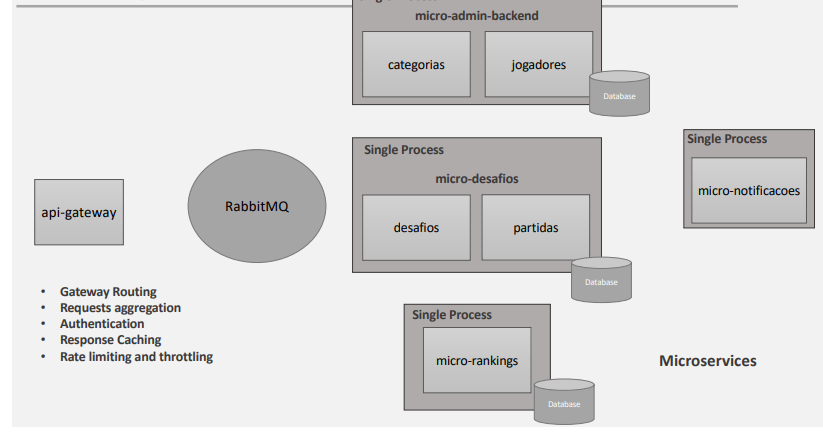

# Smart Ranking Microservices - NESTJS

_course in progress_

This project was developed in the course
[Node.js Microservices: NestJS, RabbitMQ and Cloud Services](https://www.udemy.com/course/construindo-um-backend-escalavel-com-nestjs-aws-e-pivotalws/)

It has microservices architecture using amqp protocol with [RabbitMQ](https://www.rabbitmq.com/) for communication and [mongodb](https://www.mongodb.com/pt-br) for data persistence.

# Architecture

## Stack

**Back-end:** Node, NestJS, Rabbitmq, MongoDB, S3 Aws
